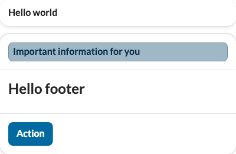

# liquid-flutter-test-utils

A Flutter package providing utilities for testing Liquid Flutter widgets, including golden image testing and widget tree verification.

It is intertwined with the [Liquid Flutter](https://pub.dev/packages/liquid_flutter) component library and the [Golden Toolkit](https://pub.dev/packages/golden_toolkit)
package for golden image testing.

## Features

- **Golden Image Testing**: Generate screenshot-like golden images for UI verification.
- **Widget Tree Testing**: Capture and verify the widget tree structure.
- **Multi-Theme Testing**: Test widgets across different Liquid theme sizes and brightness modes.
- **Flexible Frame Options**: Control how widgets are framed for testing.

## Installation

Add this package to your development dependencies running:

```bash
flutter pub add liquid_flutter_test_utils
```

## Getting Started

### Setup

Initialize the golden test environment in your test file:

```dart
import 'package:flutter_test/flutter_test.dart';
import 'package:golden_toolkit/golden_toolkit.dart';
import 'package:liquid_flutter_test_utils/golden_utils.dart';

void main() {
  setUpAll(() async {
    await setupGoldenTest();
  });

  // Your tests go here
}
```

### Basic Golden Image Testing

Test a widget and generate golden images across all Liquid theme variations:

```dart
import 'package:liquid_flutter_test_utils/multi_golden_test.dart';

testGoldens("Widget renders correctly", (tester) async {
  final widget = YourWidget();

  await multiGolden(
    tester,
    "YourWidget",
    {
      "Default": (tester, placeWidget) async {
        await placeWidget(widget);
      },
    },
  );
});
```

### Testing Multiple States

Test a widget in different states:

```dart
testGoldens("Widget renders correctly in multiple states", (tester) async {
  await multiGolden(
    tester,
    "YourWidget",
    {
      "Loading": (tester, placeWidget) async {
        await placeWidget(YourWidget(isLoading: true));
      },
      "Loaded": (tester, placeWidget) async {
        await placeWidget(YourWidget(isLoading: false, data: sampleData));
      },
      "Error": (tester, placeWidget) async {
        await placeWidget(YourWidget(hasError: true));
      },
    },
  );
});
```

### Widget Tree Testing

Verify the widget tree structure of your widget:

```dart
import 'package:liquid_flutter_test_utils/widget_tree_test.dart';

testGoldens("Widget tree matches expected structure", (tester) async {
  const key = ValueKey("MyWidget");
  final widget = ldThemeWrapper(
    child: YourWidget(key: key),
  );

  await tester.pumpWidget(widget);

  await widgetTreeMatchesGolden(
    tester,
    widget: widget,
    findWidget: (tester, widget) => find.byKey(key),
    goldenName: "YourWidgetTree",
  );
});
```

### Configuring Golden Tests

Customize how widgets are framed for testing:

```dart
await multiGolden(
  tester,
  "YourWidget",
  {
    "Default": (tester, placeWidget) async {
      await placeWidget(YourWidget());
    },
  },
  performWidgetTreeTests: true, // Generate widget tree goldens
  ldFrameOptions: LiquidFrameOptions(
    uiMode: GoldenUiMode.collapsed, // Only show the widget (no screenshot-like frame)
    width: 800, // Set custom width
  ),
);
```

## Generated Golden Files

When running the tests, the package generates golden images for all combinations of theme sizes and brightness modes. The files follow this structure:

```
test/goldens/
└── SampleLiquidWidget/
    ├── Default/
    │   ├── L_dark.png   # Large theme size, dark mode
    │   ├── L_light.png  # Large theme size, light mode
    │   ├── M_dark.png   # Medium theme size, dark mode
    │   ├── M_light.png  # Medium theme size, light mode
    │   ├── S_dark.png   # Small theme size, dark mode
    │   └── S_light.png  # Small theme size, light mode
    └── Error/
        ├── L_dark.png
        ├── L_light.png
        ├── M_dark.png
        ├── M_light.png
        ├── S_dark.png
        └── S_light.png
```

Each state of your widget (e.g., "Default", "Error") gets its own directory containing all theme variations.

Here are some example generated golden images that were generated for `SampleLiquidWidget`:

| Theme      | Dark Mode                                                 | Light Mode                                                 |
| ---------- | --------------------------------------------------------- | ---------------------------------------------------------- |
| **Large**  |  |  |
| **Medium** |  |  |
| **Small**  |  |  |

## Advanced Features

### Frame Options

The `LdFrameOptions` class is used to configure options for the [ldFrame] widget. It provides flexibility in defining the size, UI mode, and other settings for generating screenshots or UI frames. Below are the details of the class and its parameters.

#### UI Mode

The `GoldenUiMode` enum defines the available modes for how the frame should be sized. It has three possible values:

- `collapsed`: The frame will be sized to match the widget's size.
- `screen`: The frame will match the screen's size (including system UI).
- `screenWithSystemUi`: Similar to `screen`, but includes the system UI as well.

#### `LdFrameOptions` Constructor

The `LdFrameOptions` constructor allows you to configure the widget frame with the following parameters:

| Parameter        | Type           | Default Value                     | Description                                                                                                 |
| ---------------- | -------------- | --------------------------------- | ----------------------------------------------------------------------------------------------------------- |
| `width`          | `int`          | `600`                             | The width of the frame.                                                                                     |
| `height`         | `int?`         | `null`                            | The height of the frame. If `null`, the height will adjust to fit the widget or screen size.                |
| `uiMode`         | `GoldenUiMode` | `GoldenUiMode.screenWithSystemUi` | Defines how the frame should be sized (collapsed, screen, or screenWithSystemUi).                           |
| `showBackButton` | `bool`         | `false`                           | Whether the app bar should show a back button. Useful for generating screenshots for screens on sub-routes. |

### Custom Threshold for Image Comparison

Specify a threshold for image comparison to tolerate minor pixel differences:

```dart
await setupGoldenTest(
  fileComparatorThreshold: 0.02, // Accept up to 2% difference
);
```

### Custom Localizations

Provide custom localization delegates:

```dart
await setupGoldenTest(
  localizationsDelegates: [
    YourCustomLocalizationsDelegate(),
  ],
);
```

### Testing with Specific LdTheme Settings

Wrap your widget with a custom theme wrapper:

```dart
final themedWidget = ldThemeWrapper(
  brightnessMode: LdThemeBrightnessMode.dark,
  size: LdThemeSize.large,
  child: YourWidget(),
);
```

## Widget Tree Testing Details

### Overview

The widget tree testing functionality captures the structure of your widget tree in an XML format, ignoring implementation details like hash codes and internal widgets. This helps you catch unexpected structural changes in your widgets.

### Configuration Options

You can customize the behavior of widget tree testing using `WidgetTreeOptions`:

```dart
enum IncludeWidgetBounds {
  none,
  relative,
  absolute,
}

class WidgetTreeOptions {
  const WidgetTreeOptions({
    this.findWidget,
    this.goldenPath = 'test/golden_widget_trees',
    this.goldenName,
    this.strippedWidgets = defaultIgnoredWidgets,
    this.stripPrivateWidgets = true,
    this.includeWidgetBounds = IncludeWidgetBounds.relative,
  });

  final Finder Function(WidgetTester, Widget)? findWidget;
  final String goldenPath;
  final String? goldenName;
  final Set<dynamic> strippedWidgets;
  final bool stripPrivateWidgets;
  final IncludeWidgetBounds includeWidgetBounds;
}
```

### Key Configuration Options

- **Golden Path (`goldenPath`)**: Specifies the directory where golden widget trees are stored. Default: `'test/golden_widget_trees'`.
- **Golden Name (`goldenName`)**: The name of the golden file for comparison. Defaults to the widget's name.
- **Ignored Widgets (`strippedWidgets`)**: Defines a set of widgets to be stripped from the tree to reduce verbosity.
- **Strip Private Widgets (`stripPrivateWidgets`)**: If `true`, private widgets (starting with `_`) are removed. Default: `true`.
- **Include Widget Bounds (`includeWidgetBounds`)**:
  - `IncludeWidgetBounds.none`: Bounds are not included.
  - `IncludeWidgetBounds.relative`: Bounds are relative to the parent widget.
  - `IncludeWidgetBounds.absolute`: Bounds are absolute on the screen.

## Customizing Ignored Widgets

You can customize which widgets are ignored during widget tree capture:

```dart
await widgetTreeMatchesGolden(
  tester,
  widget: widget,
  options: WidgetTreeOptions(
    strippedWidgets: {
        MediaQuery,
        Material,
        MediaQuery,
        Material,
        // You can use types or strings:
        'NotificationListener', // Ignore all NotificationListener widgets, no matter the generic type
        // For generic types, you could also specify the generic type arguments:
        NotificationListener<ScrollNotification>,
        // Add other widgets to ignore
    },
  ),
);
```

This flexibility allows you to fine-tune widget tree comparisons while focusing on meaningful structural changes.

## Contributing

Contributions are welcome! Please feel free to submit a Pull Request.

## License

This project is licensed under the Apache-2.0 license. See the [LICENSE](LICENSE) file for details.
